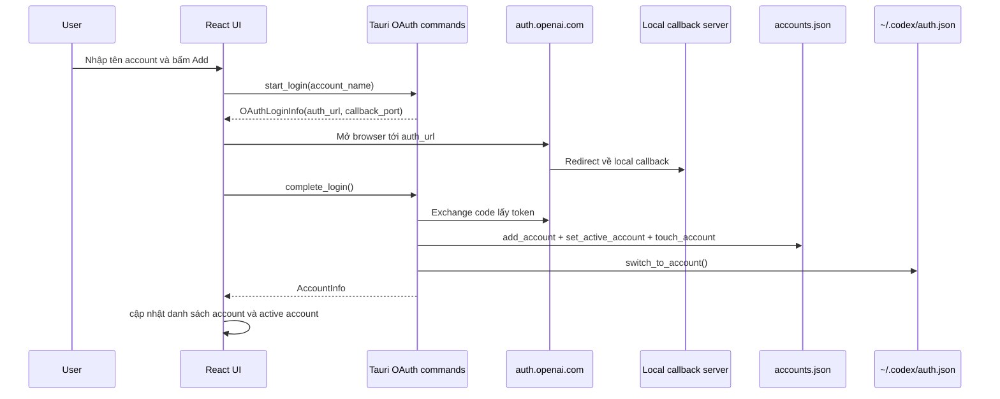
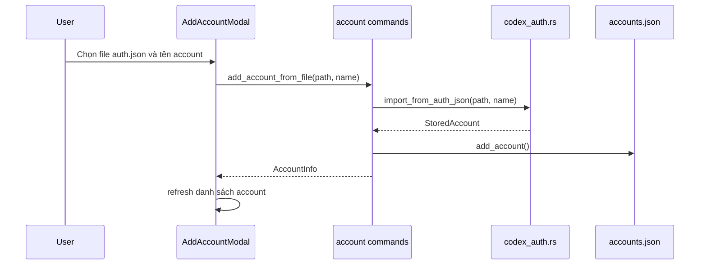
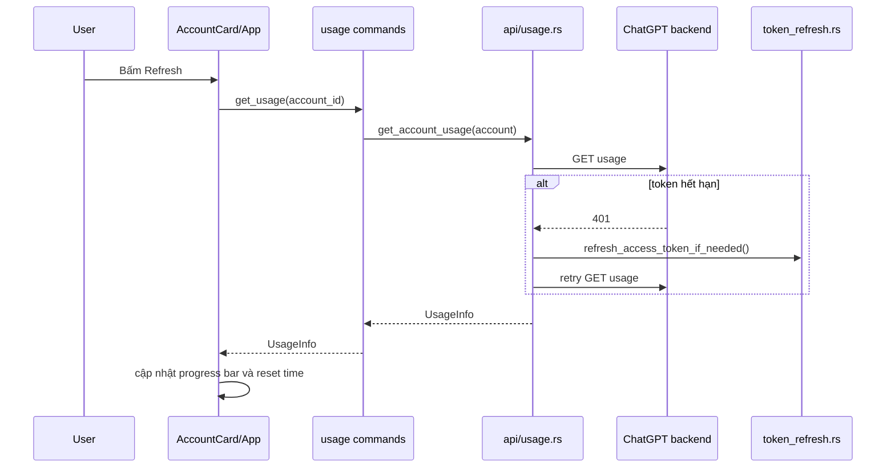
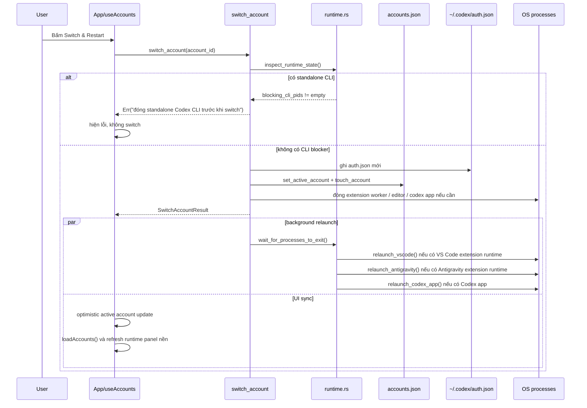
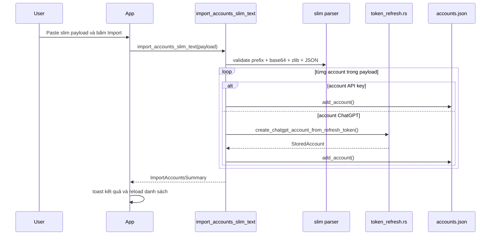
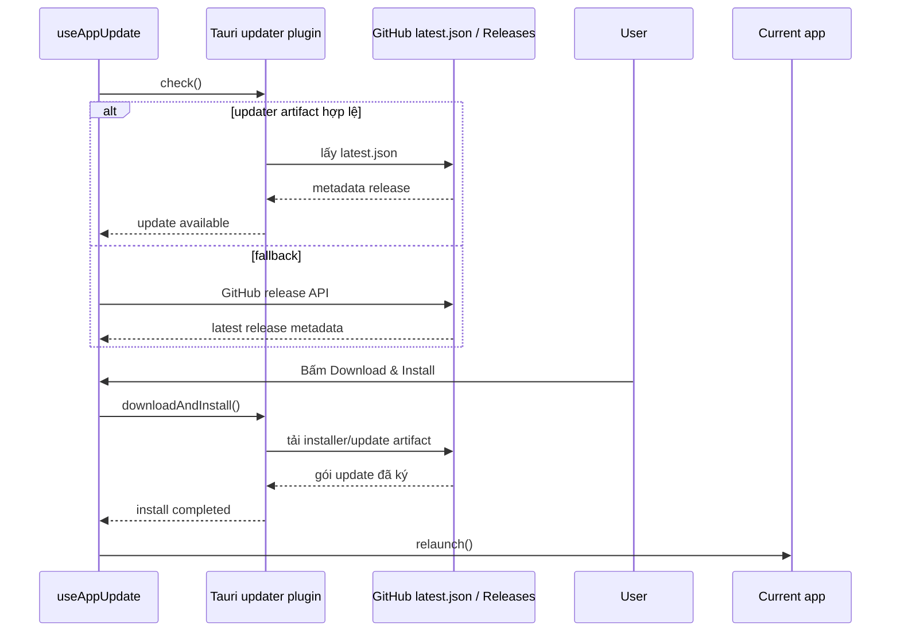
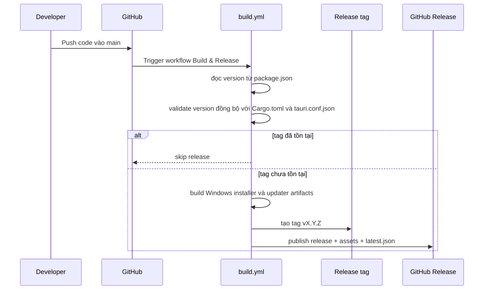

# Luồng xử lý chính

## 1. Thêm account bằng OAuth

## 2. Import account từ `auth.json`

## 3. Refresh usage cho một account

## 4. Switch account và restart runtime

## 5. Slim import nhiều account

## 6. Check update và cài bản mới

## 7. Luồng production release

## 8. Ghi chú vận hành

Hai điểm ảnh hưởng mạnh đến bảo trì:

- `switch_account` trả về trước khi mọi runtime reopen hoàn tất, nên UI và background relaunch không hoàn toàn đồng bộ
- `runtime.rs` dựa trên heuristic process classification, nên cùng một luồng có thể khác nhau giữa môi trường cài đặt khác nhau
